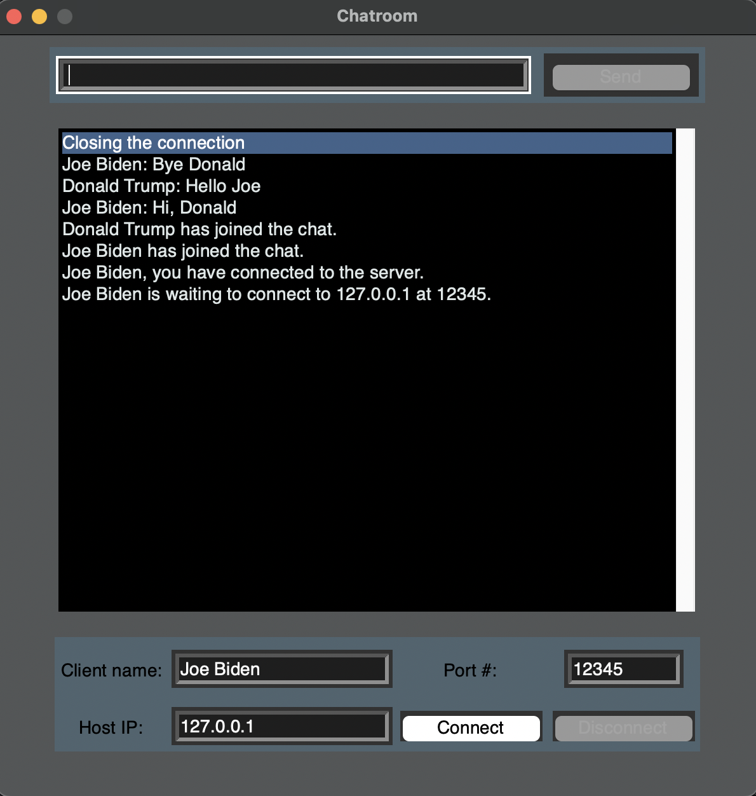

Builds upon the Terminal Chatroom project by including a GUI interface for the chat room using the Tkinter python module.

To install Tkinter:

    pip install tk

GUI allows for Name, Port, IP, and text message entry. Connect and disconnect functions have their associated buttons on the interface. 
Open multiple clients at once and have them connect to the same host to send messages to each other on the same server.

An example of a chatroom with two clients connected:

